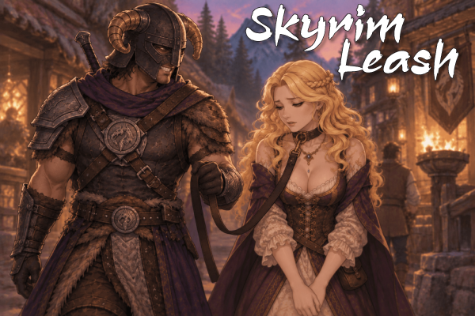

# SkyrimNet_Leash



[](https://ko-fi.com/goodprovider)

SkyrimNet (LLM) bridge for [Leash Framework](https://www.nexusmods.com/skyrimspecialedition/mods/187303). 
NPCs can leash and unleash through SkyrimNet actions, and the leashed characters are presented in each prompt. 

Changelog: [CHANGELOG.md](CHANGELOG.md) · [CHANGELOG-user.md](CHANGELOG-user.md)

## Play / install

Requirements:

- [SkyrimNet](https://github.com/MinLL/SkyrimNet-GamePlugin)
- [Leash Framework (Nexus 187303)](https://www.nexusmods.com/skyrimspecialedition/mods/187303) , [Leash Framework (Sexlab 50377)](https://www.loverslab.com/files/file/50377-leash-framework/) — `Leash.esm` and `SKSE\Plugins\LeashFramework.dll`
- SKSE, Address Library

Optional:

| Plugin | Adds |
| --- | --- |
| [PrismaUI](https://www.nexusmods.com/skyrimspecialedition/mods/114324) | Provides UI for hotkey `\` leash panel (enable/remap in SkyrimNet WebUI). YAML actions work without it. |

The FOMOD installer **refuses to install** unless `Leash.esm` is active.

Load `SkyrimNet_Leash.esp` after `Leash.esm`. Enable the mod in MO2 or Vortex.

Leash apply still needs leash bones on the target (Leash.esm armor / SMP node names). See the Leash Framework Nexus page. 

---
### Leash panel hotkey

The panel hotkey is **off by default**. Enable it in SkyrimNet’s WebUI under **Settings → Plugins → SkyrimNet Leash**.

With PrismaUI installed and the hotkey on, `\` opens a horizontal leash bar. Verb options depend on whether the selected leashed actor is already collared. Extra columns appear only for the chosen verb. If **body** is wrists, **type** is locked to chain.

| Target | Verb | Extra columns |
| --- | --- | --- |
| Unleashed | leash | distance, type, body location, holder |
| Unleashed | leash to | distance, type, body location, tie location |
| Leashed | unleash | — |
| Leashed | tie to | location |
| Leashed | give to | holder |

Press `\` again or Escape to close. The game pauses while the panel is focused.

**Unleash on this bar is full power**, including the player's own collar: pick yourself as the leashed actor (the default when you are leashed and not aiming at someone else) and **unleash** still disconnects. LLM `leash_escape` never does that.

Remap the key and default **distance** / **type** / **body part** / **tie point** in the same plugin page. SkyrimNet_SexLab’s Start Sex hotkey also defaults to `\` but is off unless you turn it on — do not bind both to the same key.

### Actions

Three categories plus one root-level action.

| Param | Values |
| --- | --- |
| Style | `forcefully` \| `normally` \| `gently` |
| Distance | `tight` \| `short` \| `middle` \| `long` |
| Type | `chain` \| `rope` \| `magic` |
| Body part | `neck` \| `wrists` \| `waist` |
| Tie point | `floor` \| `left` \| `back` \| `front` \| `right` \| `wall` |

**Wrists is chain only** — Leash.esm only ships `Leash_hand_chain`; Papyrus and the panel force type to `chain`. Holder and give-receiver may be `None` to leave the leash hanging from the collared actor (not tied to a world point). Take still picks that leash up.

**Root actions** (no category parent; `leash_none_*`)

| Action | Effect |
| --- | --- |
| leash_none_target_unleash | Speaker unclips a nearby collared actor (including someone held by a third party). Never the speaker themselves. |
| leash_none_struggle_stop | Collared speaker who is already struggling gives up and returns to default stance. Opposite of Escape. |

**leash_leash** (start a leash)

| Action | Effect |
| --- | --- |
| leash_leash_target | Speaker leashes the target. Holder is the speaker, another nearby actor, or None (dangling). Wrists uses the chain hand mesh and prisoner cuffs / bound-standing idle. |
| leash_leash_speaker | A nearby actor leashes the speaker. Holder is that actor or None. Speaker must not already be leashed. |
| leash_leash_tie_target | Speaker ties an unleashed target to a world point. |
| leash_leash_refused_speaker | Speaker refuses to be leashed by a nearby actor. |
| leash_leash_refused_target | A nearby actor refuses to be leashed by the speaker. |

**leash_change** (move an existing leash)

| Action | Effect |
| --- | --- |
| leash_change_take_target | Speaker takes a collared actor's leash. |
| leash_change_take_speaker | A nearby actor takes the speaker's leash. Speaker must be leashed. |
| leash_change_give_target | Speaker gives a collared actor's leash to another nearby actor, or to None (drops it). |
| leash_change_give_speaker | A nearby actor gives the speaker's leash to another nearby actor, or to None. |
| leash_change_tie_target | Speaker re-ties a collared actor's leash to a world point. |
| leash_change_tie_speaker | A nearby actor re-ties the speaker's leash to a world point. |

**leash_escape** (try to get free of your own leash)

| Action | Effect |
| --- | --- |
| leash_escape_struggle | Collared speaker starts struggling: looping `IdleNervous` while standing, and they keep struggling if they walk. Ends on `leash_none_struggle_stop`, a yank, or unclip. First line is DirectNarration. The leash does not come off. |

Children may be leashed. Free self-unleash is **not** an LLM action — NPCs cannot pick `leash_escape` and come off. The player still can: the PrismaUI `\` panel **unleash** verb fully unclips, including the player's own leash. `leash_escape_struggle` only plays an idle and narrates; a later minigame will be the NPC self-free path.

Higher importance uses SkyrimNet DirectNarration so nearby NPCs react immediately; lower importance records a `leash` event for context without interrupting speech. If the player is not the subject, leashed actor, or holder and has no line of sight on the leashed actor, the line is always an event.

| Importance | Lines | Narration |
| --- | --- | --- |
| 1 | Apply, take, give, tie, refuse, unleash, or start struggling while the player is subject, leashed, holder, or give-receiver | Always DirectNarration |
| 2 | Those same actions without the player, a ragdoll stumble, stop struggling, or a later struggle beat while the speech queue is empty | DirectNarration if SkyrimNet’s speech queue is empty, otherwise a `leash` event |
| 3 | Taut (non-ragdoll) pull, an in-progress struggle pulse, or a later struggle beat / stop struggling while the speech queue is busy | Short-lived `leash` event (taut and struggle pulse) or a `leash` event (optional) |

## Build from clone

Prerequisites: Git, Visual Studio 2022 (Desktop C++), CMake 3.21+, [vcpkg](https://github.com/microsoft/vcpkg) with `VCPKG_ROOT` set. Use an “x64 Native Tools” / Developer PowerShell prompt so `cl.exe` is on PATH.

```text
git clone --recurse-submodules https://github.com/GoodProvider/SkyrimNet_Leash.git
cd SkyrimNet_Leash
```

If you already cloned without submodules:

```text
git submodule update --init --recursive
```

Later updates:

```text
git pull
git submodule update --init --recursive
git submodule update --remote --merge
```

### Papyrus

VS Code / Cursor task **`compile: pyro`** (uses `skyrimse.ppj` and `Scripts/Source`).

### SKSE plugin

VS Code / Cursor tasks **`CMake: Configure (Debug)`** then **`CMake: Build SKSE (Debug)`**, or CLI:

```text
cd SKSE_Source
cmake --preset debug
cmake --build --preset build-debug
```

Release: `--preset release` / `build-release`.

Those tasks copy `SkyrimNet_Leash.dll` to `SKSE/Plugins/`. If `SKYRIM_MODS_FOLDER` is set to your MO2 mods folder, CMake also deploys into `SKYRIM_MODS_FOLDER/SkyrimNet Leash/SKSE/Plugins/`.

Confirm the mod folder contains:

- `SKSE/Plugins/SkyrimNet_Leash.dll`
- `SKSE/Plugins/SkyrimNet/config/actions/`
- `SKSE/Plugins/SkyrimNet/config/plugins/SkyrimNet_Leash/manifest.yaml`
- `PrismaUI/views/SkyrimNet_Leash/index.html`
- `SKSE/Plugins/SkyrimNet/prompts/submodules/character_bio/0409_leashframework.prompt`
- `SkyrimNet_Leash.esp`
- compiled `Scripts/SkyrimNet_Leash_Actions.pex`, `Scripts/SkyrimNet_Leash_PlayerAlias.pex`, and `Scripts/SkyrimNet_Leash_Native.pex`

### ESP from Spriggit

`Spriggit/SkyrimNet_Leash/` is the ESP source. Deserialize with Spriggit when you need a binary `.esp`:

```text
dotnet tool run spriggit deserialize -i Spriggit/SkyrimNet_Leash -o SkyrimNet_Leash.esp
```

### Package

`make release` stamps FOMOD from `Makefile` `VERSION` and packs `versions/SkyrimNet_Leash ${VERSION}.7z` (no PDBs). GitHub Actions **Package** (`workflow_dispatch`) builds Release SKSE and uploads that zip as a private artifact for MO2 playtesting, plus a separate PDB artifact. Play the zip before tagging.
